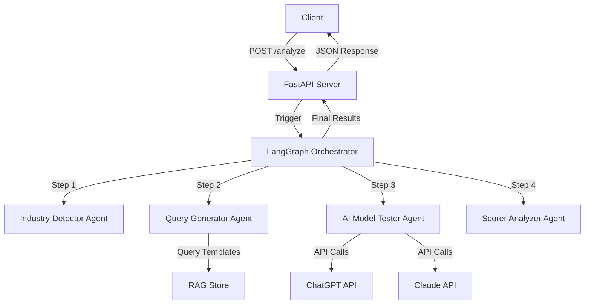
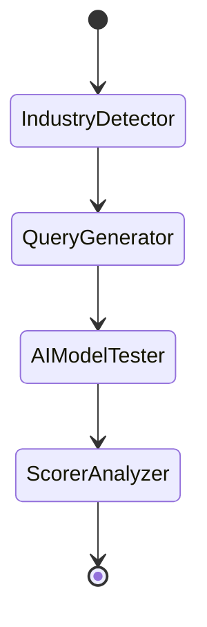

# Design Document

## Overview

The AI Visibility Scoring System is built as a modular FastAPI application that uses LangGraph to orchestrate a sequential multi-agent workflow. The architecture prioritizes simplicity, testability, and clear separation of concerns. Each agent operates independently and can be tested in isolation, while LangGraph manages the state flow between agents.

The system follows a straightforward data flow: API request → LangGraph orchestration → sequential agent execution → final response. For V1, we use in-memory storage, support 2 AI models (ChatGPT and Claude), and generate 20 queries per analysis.

## Architecture

### High-Level Architecture Diagram



### Component Layers

1. **API Layer** (main.py): Handles HTTP requests, validation, and responses
2. **Orchestration Layer** (graph_orchestrator.py): Manages workflow state and agent sequencing
3. **Agent Layer** (agents/): Independent processing units for each analysis step
4. **Storage Layer** (storage/): In-memory data persistence for company and query data
5. **Configuration Layer** (config/): Environment variables and settings management
6. **Model Layer** (models/): Type definitions and data schemas

### Design Principles

- **Simplicity First**: Start with the simplest implementation that works
- **Agent Independence**: Each agent is a pure function that takes state and returns updated state
- **Type Safety**: Use Pydantic models throughout for validation and type checking
- **Fail Gracefully**: Handle errors without crashing the entire workflow
- **Testability**: Each component can be tested independently

## Components and Interfaces

### 1. FastAPI Server (main.py)

**Purpose**: HTTP interface for triggering analyses and checking system health

**Endpoints**:

- `GET /health`: Returns system status
- `POST /analyze`: Accepts company URL and triggers workflow

**Interface**:

```python
# Request Model
class AnalyzeRequest(BaseModel):
    company_url: str
    company_name: Optional[str] = None
    company_description: Optional[str] = None

# Response Model
class AnalyzeResponse(BaseModel):
    job_id: str
    status: str
    industry: str
    visibility_score: float
    total_queries: int
    total_mentions: int
    model_results: Dict[str, Any]
```

**Responsibilities**:

- Validate incoming requests
- Call LangGraph orchestrator
- Return formatted responses
- Handle HTTP errors

### 2. LangGraph Orchestrator (graph_orchestrator.py)

**Purpose**: Define and execute the sequential workflow connecting all agents

**State Schema**:

```python
class WorkflowState(TypedDict):
    company_url: str
    company_name: str
    company_description: str
    industry: str
    queries: List[str]
    model_responses: Dict[str, List[str]]  # {model_name: [responses]}
    visibility_score: float
    analysis_report: Dict[str, Any]
    errors: List[str]
```

**Graph Structure**:



**Responsibilities**:

- Initialize workflow state from API request
- Execute agents in sequence
- Pass state between agents
- Collect and return final results
- Handle agent failures

**Key Functions**:

- `create_workflow_graph()`: Builds the LangGraph state graph
- `run_analysis(company_url, company_name, company_description)`: Executes the workflow

### 3. Industry Detector Agent (agents/industry_detector.py)

**Purpose**: Analyze company information and classify into industry category

**Input**: WorkflowState with company_url, company_name, company_description
**Output**: Updated WorkflowState with industry field populated

**Interface**:

```python
def detect_industry(state: WorkflowState) -> WorkflowState:
    """
    Analyzes company information and returns industry classification.

    For V1: Uses simple keyword matching and heuristics.
    Future: Can integrate with LLM for smarter classification.
    """
    pass
```

**Supported Industries** (V1):

- technology
- retail
- healthcare
- finance
- food_services
- other

**Logic**:

1. Extract keywords from company name and description
2. Match against industry keyword patterns
3. Return best matching industry or "other"
4. Update state with detected industry

### 4. Query Generator Agent (agents/query_generator.py)

**Purpose**: Generate industry-specific search queries for AI model testing

**Input**: WorkflowState with industry field
**Output**: Updated WorkflowState with queries list (20 queries)

**Interface**:

```python
def generate_queries(state: WorkflowState) -> WorkflowState:
    """
    Generates 20 industry-specific queries using templates from RAG store.
    """
    pass
```

**Query Template Structure**:

```python
# Stored in RAG Store
QUERY_TEMPLATES = {
    "technology": [
        "What are the best {category} companies?",
        "Recommend {category} solutions for {use_case}",
        "Compare {category} providers",
        # ... more templates
    ],
    "food_services": [
        "Best meal kit delivery services",
        "Healthy meal subscription options",
        # ... more templates
    ]
}
```

**Logic**:

1. Retrieve query templates for detected industry from RAG Store
2. Customize templates with company name and context
3. Generate 20 unique queries
4. Update state with queries list

### 5. AI Model Tester Agent (agents/ai_model_tester.py)

**Purpose**: Execute queries across multiple AI models and collect responses

**Input**: WorkflowState with queries list
**Output**: Updated WorkflowState with model_responses dictionary

**Interface**:

```python
def test_ai_models(state: WorkflowState) -> WorkflowState:
    """
    Executes all queries against ChatGPT and Claude.
    Returns responses organized by model.
    """
    pass
```

**Supported Models** (V1):

- ChatGPT (gpt-4 or gpt-3.5-turbo)
- Claude (claude-3-sonnet)

**API Integration**:

```python
# ChatGPT
from openai import OpenAI
client = OpenAI(api_key=settings.OPENAI_API_KEY)

# Claude
from anthropic import Anthropic
client = Anthropic(api_key=settings.ANTHROPIC_API_KEY)
```

**Logic**:

1. For each query in state.queries:
   - Send to ChatGPT API
   - Send to Claude API
   - Collect responses
2. Handle API failures gracefully (log error, continue)
3. Store responses in format: `{model_name: [response1, response2, ...]}`
4. Update state with model_responses

**Error Handling**:

- Retry failed requests once
- Log errors to state.errors list
- Continue workflow even if some queries fail

### 6. Scorer Analyzer Agent (agents/scorer_analyzer.py)

**Purpose**: Calculate visibility score and generate analysis report

**Input**: WorkflowState with model_responses
**Output**: Updated WorkflowState with visibility_score and analysis_report

**Interface**:

```python
def analyze_score(state: WorkflowState) -> WorkflowState:
    """
    Calculates visibility score based on company mentions in responses.
    Generates detailed analysis report.
    """
    pass
```

**Scoring Algorithm**:

```python
# For each response:
# - Check if company name appears in response
# - Count total mentions
# - Calculate percentage: (mentions / total_queries) * 100

visibility_score = (total_mentions / (len(queries) * num_models)) * 100
```

**Analysis Report Structure**:

```python
{
    "visibility_score": 75.5,
    "total_queries": 20,
    "total_responses": 40,  # 20 queries * 2 models
    "total_mentions": 30,
    "mention_rate": 0.75,
    "by_model": {
        "chatgpt": {
            "mentions": 16,
            "mention_rate": 0.80
        },
        "claude": {
            "mentions": 14,
            "mention_rate": 0.70
        }
    },
    "sample_mentions": [
        "Query: 'Best meal kits' -> ChatGPT mentioned company",
        # ... up to 5 examples
    ]
}
```

**Logic**:

1. Iterate through all model responses
2. Search for company name in each response (case-insensitive)
3. Count mentions per model
4. Calculate overall visibility score
5. Generate detailed report with breakdowns
6. Update state with score and report

## Data Models

### Pydantic Schemas (models/schemas.py)

```python
from pydantic import BaseModel, HttpUrl, Field
from typing import Optional, List, Dict, Any
from typing_extensions import TypedDict

# API Request/Response Models
class AnalyzeRequest(BaseModel):
    company_url: HttpUrl
    company_name: Optional[str] = None
    company_description: Optional[str] = None

class AnalyzeResponse(BaseModel):
    job_id: str
    status: str
    industry: str
    visibility_score: float
    total_queries: int
    total_mentions: int
    model_results: Dict[str, Any]

class HealthResponse(BaseModel):
    status: str
    version: str

# LangGraph State Model
class WorkflowState(TypedDict):
    company_url: str
    company_name: str
    company_description: str
    industry: str
    queries: List[str]
    model_responses: Dict[str, List[str]]
    visibility_score: float
    analysis_report: Dict[str, Any]
    errors: List[str]

# RAG Store Models
class CompanyProfile(BaseModel):
    name: str
    url: str
    description: str
    industry: str

class CompetitorProfile(BaseModel):
    name: str
    url: Optional[str] = None
    description: Optional[str] = None
    industry: str
```

## Storage Layer

### RAG Store (storage/rag_store.py)

**Purpose**: In-memory storage for company profiles, competitors, and query templates

**V1 Implementation**: Python dictionaries (no external database)

**Interface**:

```python
class RAGStore:
    def __init__(self):
        self.companies: Dict[str, CompanyProfile] = {}
        self.competitors: Dict[str, List[CompetitorProfile]] = {}
        self.query_templates: Dict[str, List[str]] = {}

    def store_company(self, profile: CompanyProfile) -> None:
        """Store or update company profile"""
        pass

    def get_company(self, name: str) -> Optional[CompanyProfile]:
        """Retrieve company profile by name"""
        pass

    def store_competitors(self, company_name: str, competitors: List[CompetitorProfile]) -> None:
        """Store competitor list for a company"""
        pass

    def get_query_templates(self, industry: str) -> List[str]:
        """Retrieve query templates for industry"""
        pass

    def initialize_templates(self) -> None:
        """Load default query templates for all industries"""
        pass
```

**Default Query Templates**:

- Pre-populated templates for each supported industry
- Loaded during RAGStore initialization
- Customizable per company analysis

**Data Structure**:

```python
# In-memory storage
{
    "companies": {
        "HelloFresh": CompanyProfile(...),
        "Blue Apron": CompanyProfile(...)
    },
    "competitors": {
        "HelloFresh": [CompetitorProfile(...), ...]
    },
    "query_templates": {
        "food_services": [
            "What are the best meal kit delivery services?",
            "Recommend healthy meal subscription options",
            # ... 20+ templates
        ],
        "technology": [...]
    }
}
```

## Configuration Management

### Settings Module (config/settings.py)

**Purpose**: Centralized configuration using environment variables

**Implementation**:

```python
from pydantic_settings import BaseSettings

class Settings(BaseSettings):
    # API Keys
    OPENAI_API_KEY: str
    ANTHROPIC_API_KEY: str

    # Application Settings
    APP_NAME: str = "AI Visibility Scoring System"
    APP_VERSION: str = "1.0.0"
    DEBUG: bool = False

    # Model Settings
    CHATGPT_MODEL: str = "gpt-3.5-turbo"
    CLAUDE_MODEL: str = "claude-3-sonnet-20240229"

    # Query Settings
    NUM_QUERIES: int = 20

    class Config:
        env_file = ".env"
        case_sensitive = True

settings = Settings()
```

**Environment Variables** (.env):

```
OPENAI_API_KEY=sk-...
ANTHROPIC_API_KEY=sk-ant-...
DEBUG=true
```

## Error Handling

### Error Strategy

1. **API Layer Errors**:

   - Invalid request format → 400 Bad Request
   - Missing required fields → 422 Unprocessable Entity
   - Internal errors → 500 Internal Server Error

2. **Agent Errors**:

   - Log error to state.errors list
   - Continue workflow with partial results
   - Include error information in final response

3. **AI Model API Errors**:

   - Retry once on failure
   - Log failed queries
   - Continue with successful responses
   - Report success rate in analysis

4. **Validation Errors**:
   - Pydantic handles validation automatically
   - Return clear error messages to client

### Error Response Format

```python
class ErrorResponse(BaseModel):
    error: str
    detail: str
    status_code: int
```

## Testing Strategy

### Unit Testing

**Test Each Agent Independently**:

```python
# tests/test_industry_detector.py
def test_detect_technology_industry():
    state = {"company_name": "TechCorp", "company_description": "Software solutions"}
    result = detect_industry(state)
    assert result["industry"] == "technology"

# tests/test_query_generator.py
def test_generate_queries_count():
    state = {"industry": "food_services", "company_name": "HelloFresh"}
    result = generate_queries(state)
    assert len(result["queries"]) == 20
```

**Test RAG Store**:

```python
# tests/test_rag_store.py
def test_store_and_retrieve_company():
    store = RAGStore()
    profile = CompanyProfile(name="Test", url="https://test.com", ...)
    store.store_company(profile)
    retrieved = store.get_company("Test")
    assert retrieved.name == "Test"
```

### Integration Testing

**Test Complete Workflow**:

```python
# tests/test_workflow.py
def test_full_analysis_workflow():
    result = run_analysis(
        company_url="https://hellofresh.com",
        company_name="HelloFresh",
        company_description="Meal kit delivery"
    )
    assert "industry" in result
    assert "visibility_score" in result
    assert len(result["queries"]) == 20
```

**Test API Endpoints**:

```python
# tests/test_api.py
def test_analyze_endpoint(client):
    response = client.post("/analyze", json={
        "company_url": "https://example.com",
        "company_name": "Example Corp"
    })
    assert response.status_code == 200
    assert "visibility_score" in response.json()
```

### Mock Strategy for V1

- Mock AI model API calls in tests to avoid costs
- Use fixture data for expected responses
- Test error handling with simulated failures

```python
# tests/conftest.py
@pytest.fixture
def mock_openai_response():
    return "HelloFresh is a great meal kit service..."

@pytest.fixture
def mock_claude_response():
    return "For meal kits, I recommend HelloFresh..."
```

## Deployment Considerations

### V1 Deployment

- Single FastAPI server instance
- In-memory storage (data lost on restart)
- Environment variables for API keys
- No authentication required initially

### Future Enhancements

- Persistent storage (PostgreSQL + ChromaDB)
- Job queue for async processing (Celery/Redis)
- Authentication and rate limiting
- Streaming responses for real-time updates
- Support for additional AI models
- Caching layer for repeated queries
- Monitoring and logging (Prometheus/Grafana)

## File Structure Summary

```
project/
├── main.py                      # FastAPI server with /health and /analyze endpoints
├── graph_orchestrator.py        # LangGraph workflow definition and execution
├── config/
│   ├── __init__.py
│   └── settings.py              # Pydantic Settings for env vars
├── agents/
│   ├── __init__.py
│   ├── industry_detector.py     # Industry classification logic
│   ├── query_generator.py       # Query generation from templates
│   ├── ai_model_tester.py       # API calls to ChatGPT and Claude
│   └── scorer_analyzer.py       # Score calculation and reporting
├── models/
│   ├── __init__.py
│   └── schemas.py               # Pydantic models for all data structures
├── storage/
│   ├── __init__.py
│   └── rag_store.py             # In-memory storage with dict-based implementation
└── utils/
    ├── __init__.py
    └── helpers.py               # Common utility functions
```

Each file has a single, clear responsibility and can be developed and tested independently.
