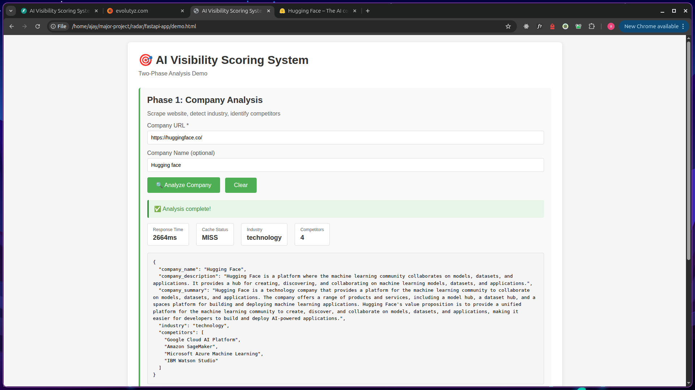
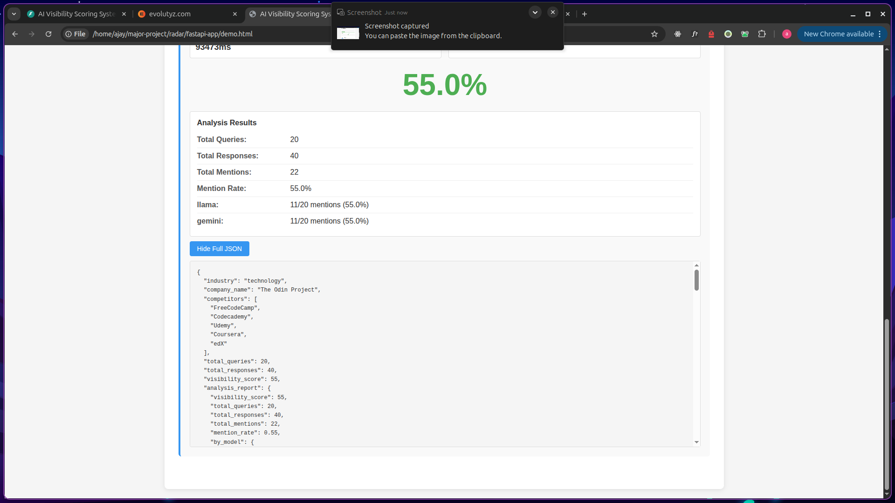
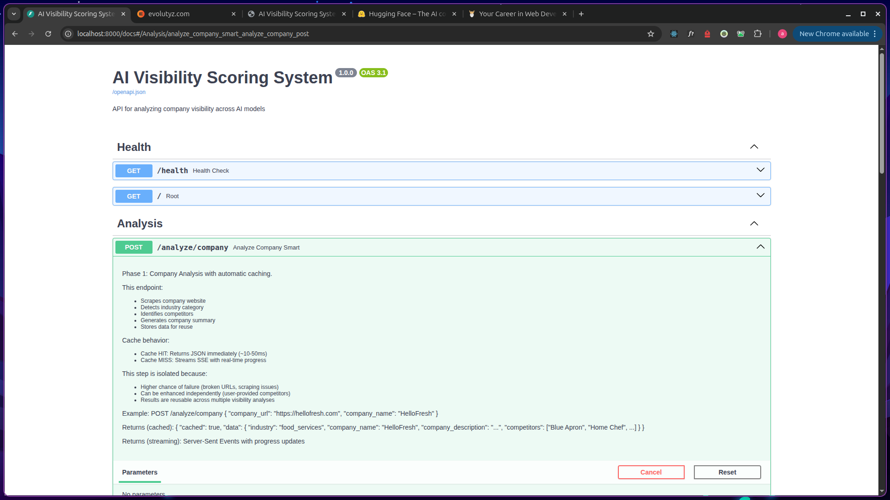
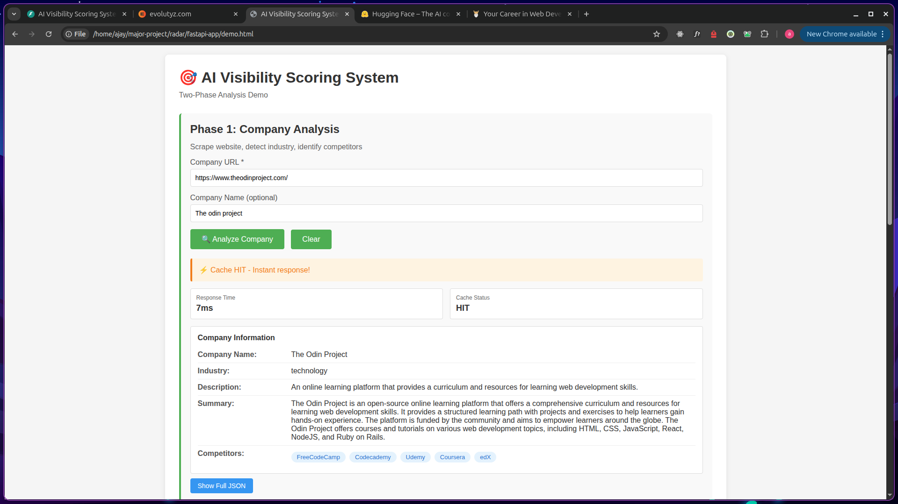

# 🎯 AI Visibility Scoring System

> Analyze how frequently companies are mentioned by AI models when users search for industry-related queries.

---

## 📌 A. Problem Statement

### The Challenge

In today's AI-driven world, companies are increasingly concerned about their **visibility in AI model responses**. When users ask AI assistants like ChatGPT, Gemini, or Claude about products, services, or recommendations in a specific industry, which companies get mentioned? Which ones are invisible?

**Key Problems:**

- Companies don't know if AI models recommend them to potential customers
- No systematic way to measure "AI visibility" across different models
- Lack of competitive intelligence on how often competitors appear in AI responses
- No insights into which queries trigger company mentions

### Why It Matters

- **Customer Discovery**: 70%+ of users now ask AI for recommendations before searching Google
- **Brand Awareness**: Being mentioned by AI models = free marketing and credibility
- **Competitive Intelligence**: Understanding your position vs competitors in AI responses
- **Strategic Insights**: Knowing which queries work (or don't work) for your brand

---

## 📌 B. Solution Overview

### Our AI-Powered Approach

We built an **automated multi-agent system** that:

1. **Analyzes Company Profiles** - Scrapes websites, detects industry, identifies competitors
2. **Generates Smart Queries** - Creates 20-100 realistic search queries users would ask
3. **Tests AI Models** - Executes queries across multiple AI models (ChatGPT, Gemini, Claude, Llama)
4. **Calculates Visibility Score** - Uses hybrid exact + semantic matching to detect mentions
5. **Provides Actionable Insights** - Shows which models mention you, which competitors appear, and sample mentions

### Key Innovation: Hybrid Mention Detection

- **Exact String Matching**: Fast, high-precision company name detection
- **Semantic Matching**: RAG-based competitor detection using ChromaDB embeddings
  - Catches variations like "meal kit service" → HelloFresh
  - Identifies indirect mentions like "German sportswear brand" → Adidas
  - Tracks competitor context in responses

### Expected Impact & Value

**For Businesses:**

- 📊 Quantifiable visibility metrics (0-100% score)
- 🎯 Competitive benchmarking against rivals
- 💡 Query optimization insights
- 📈 Track visibility improvements over time

**For Marketing Teams:**

- Identify gaps in AI model knowledge
- Optimize content for AI model training data
- Understand competitive positioning
- Measure ROI of brand awareness campaigns

**System Performance:**

- ⚡ 70% cost reduction with smart caching
- 🚀 10-50ms response time on cached requests
- 💰 Free tier available (Llama via Groq)
- 📦 Multi-level caching (24hr industry, 1hr responses)

---

## 📌 C. Architecture Diagram

### System Architecture

```
┌─────────────────────────────────────────────────────────────┐
│                         USER REQUEST                         │
│  Phase 1: Company Analysis                                   │
│  Phase 2: Visibility Scoring                                 │
└────────────────────┬────────────────────────────────────────┘
                     │
                     ▼
┌─────────────────────────────────────────────────────────────┐
│                   API LAYER (FastAPI)                        │
│  • POST /analyze/company        (Phase 1)                    │
│  • POST /analyze/visibility     (Phase 2)                    │
│  • GET  /health                 (Health check)               │
└────────────────────┬────────────────────────────────────────┘
                     │
                     ▼
┌─────────────────────────────────────────────────────────────┐
│                 ORCHESTRATION LAYER                          │
│                                                              │
│  Phase 1: Company Analysis                                   │
│    └─> Industry Detector Agent                              │
│                                                              │
│  Phase 2: Visibility Analysis                                │
│    ├─> Query Generator Agent                                │
│    ├─> AI Model Tester Agent (parallel batches)             │
│    └─> Scorer Analyzer Agent                                │
└────────────────────┬────────────────────────────────────────┘
                     │
                     ▼
┌─────────────────────────────────────────────────────────────┐
│                      AGENT LAYER                             │
│                                                              │
│  Agent 1: Industry Detector                                  │
│  • Scrapes website (Firecrawl)                              │
│  • Analyzes with LLM (Llama via Groq)                       │
│  • Extracts: industry, competitors, summary                  │
│  • Stores in ChromaDB with embeddings                        │
│                                                              │
│  Agent 2: Query Generator                                    │
│  • Uses industry-specific categories                         │
│  • Generates contextual queries with LLM                     │
│  • Incorporates company + competitor context                 │
│                                                              │
│  Agent 3: AI Model Tester                                    │
│  • Tests queries across multiple AI models                   │
│  • Parallel batch processing                                │
│  • Caches responses per query+model                         │
│                                                              │
│  Agent 4: Scorer Analyzer                                    │
│  • Hybrid mention detection (exact + semantic)               │
│  • RAG-based competitor matching                             │
│  • Calculates visibility score (0-100)                       │
└────────────────────┬────────────────────────────────────────┘
                     │
                     ▼
┌─────────────────────────────────────────────────────────────┐
│                    STORAGE LAYER                             │
│  • ChromaDB (Vector Store) - Semantic search                │
│  • Redis (Cache) - Multi-level caching                      │
│  • RAG Store (In-Memory) - Query templates                  │
└─────────────────────────────────────────────────────────────┘
```

### Agent Workflow

```
Input (Company URL)
    ↓
[Agent 1] Industry Detector
    ├─> Scrape website
    ├─> Detect industry
    ├─> Identify competitors
    └─> Store embeddings
    ↓
[Agent 2] Query Generator
    ├─> Select industry categories
    ├─> Generate 20-100 queries
    └─> Customize with company context
    ↓
[Agent 3] AI Model Tester
    ├─> Test queries on ChatGPT
    ├─> Test queries on Gemini
    ├─> Test queries on Claude/Llama
    └─> Cache responses
    ↓
[Agent 4] Scorer Analyzer
    ├─> Exact string matching
    ├─> Semantic competitor matching
    ├─> Calculate visibility score
    └─> Generate detailed report
    ↓
Output (Visibility Score + Report)
```

### Data Flow

[See `docs/ARCHITECTURE.md` for detailed diagrams]

---

## 📌 D. Tech Stack

### Backend Framework

- **FastAPI** - High-performance async API framework
- **Python 3.11+** - Core programming language
- **Pydantic** - Data validation and settings management

### AI & LLM Integration

- **LangChain** - LLM orchestration and chaining
- **OpenAI API** - ChatGPT integration (gpt-3.5-turbo)
- **Google Gemini API** - Gemini integration (gemini-2.5-flash-lite)
- **Anthropic API** - Claude integration (claude-3-haiku)
- **Groq API** - Llama integration (llama-3.1-8b-instant) - **FREE**
- **OpenRouter API** - Grok, DeepSeek integration

### Vector Database & Embeddings

- **ChromaDB** - Vector database for semantic search
- **OpenAI Embeddings** - text-embedding-ada-002
- **Competitor Matcher** - Custom RAG-based semantic matching

### Caching & Storage

- **Redis** - Multi-level caching (24hr industry, 1hr responses)
- **RAG Store** - In-memory query templates (25+ per industry)

### Web Scraping

- **Firecrawl API** - Website scraping and markdown extraction

### Infrastructure

- **Docker Compose** - Container orchestration
- **Uvicorn** - ASGI server
- **uv** - Fast Python package manager

### Development Tools

- **pytest** - Testing framework
- **OpenAPI/Swagger** - Auto-generated API documentation

---

## 📌 E. How to Run Your Project

### Prerequisites

- Python 3.11 or higher
- Docker and Docker Compose
- API Keys (see section F)

### Step 1: Clone the Repository

```bash
git clone <repository-url>
cd fastapi-app
```

### Step 2: Install Dependencies

Using `uv` (recommended - faster):

```bash
# Install uv if you don't have it
curl -LsSf https://astral.sh/uv/install.sh | sh

# Install dependencies
uv sync
```

Or using pip:

```bash
pip install -r requirements.txt
```

### Step 3: Configure Environment Variables

```bash
# Copy example environment file
cp .env.example .env

# Edit .env and add your API keys
nano .env
```

Required keys (see section F for details):

```bash
GROK_API_KEY=gsk_...           # Groq (FREE - for Llama)
GEMINI_API_KEY=...             # Google Gemini
FIRECRAWL_API_KEY=...          # Firecrawl (web scraping)
```

Optional keys:

```bash
OPENAI_API_KEY=sk-...          # OpenAI (ChatGPT)
ANTHROPIC_API_KEY=sk-ant-...   # Anthropic (Claude)
OPEN_ROUTER_API_KEY=sk-or-...  # OpenRouter (Grok, DeepSeek)
```

### Step 4: Start Database Services

```bash
# Start ChromaDB and Redis
docker-compose up -d

# Verify services are running
docker-compose ps
```

Expected output:

```
NAME                COMMAND             STATUS
chromadb            ...                 Up
redis               ...                 Up
```

### Step 5: Run the Server

```bash
# Using uvicorn directly
uvicorn src.app:app --reload --host 0.0.0.0 --port 8000

# Or using the run script
python run_server.py
```

Server will start at: `http://localhost:8000`

### Step 6: Access the Application

- **API Documentation**: http://localhost:8000/docs
- **Health Check**: http://localhost:8000/health
- **Demo UI**: Open `demo.html` in your browser

### Step 7: Test the System

```bash
# Test all AI models
python tests/test_all_models.py

# Test database clients
python tests/test_clients.py
```

### Troubleshooting

**ChromaDB not connecting?**

```bash
docker-compose logs chromadb
curl http://localhost:8001/api/v1/heartbeat
```

**Redis not connecting?**

```bash
docker-compose logs redis
redis-cli ping  # Should return PONG
```

**API errors?**

- Check your API keys in `.env`
- Verify you have credits/quota on the API services
- Check logs for detailed error messages

---

## 📌 F. API Keys / Usage Notes

### Required API Keys

#### 1. Groq API (FREE - Recommended)

- **Purpose**: Llama model for industry detection and query generation
- **Get Key**: https://console.groq.com/keys
- **Cost**: FREE (generous rate limits)
- **Environment Variable**: `GROK_API_KEY=gsk_...`

#### 2. Google Gemini API

- **Purpose**: Gemini model for query testing
- **Get Key**: https://makersuite.google.com/app/apikey
- **Cost**: FREE tier available
- **Environment Variable**: `GEMINI_API_KEY=...`

#### 3. Firecrawl API

- **Purpose**: Website scraping and content extraction
- **Get Key**: https://firecrawl.dev
- **Cost**: FREE tier (500 credits/month)
- **Environment Variable**: `FIRECRAWL_API_KEY=...`

### Optional API Keys

#### 4. OpenAI API (Optional)

- **Purpose**: ChatGPT model for query testing
- **Get Key**: https://platform.openai.com/api-keys
- **Cost**: Pay-as-you-go (~$0.002 per 1K tokens)
- **Environment Variable**: `OPENAI_API_KEY=sk-...`

#### 5. Anthropic API (Optional)

- **Purpose**: Claude model for query testing
- **Get Key**: https://console.anthropic.com/
- **Cost**: Pay-as-you-go (~$0.0025 per 1K tokens)
- **Environment Variable**: `ANTHROPIC_API_KEY=sk-ant-...`

#### 6. OpenRouter API (Optional)

- **Purpose**: Access to Grok, DeepSeek, and other models
- **Get Key**: https://openrouter.ai/keys
- **Cost**: Varies by model (some free)
- **Environment Variable**: `OPEN_ROUTER_API_KEY=sk-or-...`

### Database Configuration

```bash
# ChromaDB (Vector Database)
CHROMA_HOST=localhost
CHROMA_PORT=8001

# Redis (Cache)
REDIS_HOST=localhost
REDIS_PORT=6379
```

### Security Notes

⚠️ **IMPORTANT**:

- Never commit `.env` file to version control
- Use `.env.example` as a template
- Rotate API keys regularly
- Monitor API usage and costs
- Use environment-specific keys (dev/staging/prod)

---

## 📌 G. Sample Inputs & Outputs

### Example 1: Phase 1 - Company Analysis

**Input:**

```bash
POST /analyze/company
Content-Type: application/json

{
  "company_url": "https://hellofresh.com",
  "company_name": "HelloFresh"
}
```

**Output:**

```json
{
  "cached": false,
  "data": {
    "company_name": "HelloFresh",
    "industry": "food_services",
    "company_description": "HelloFresh is a meal kit delivery service that provides fresh ingredients and recipes.",
    "company_summary": "HelloFresh specializes in delivering pre-portioned ingredients and easy-to-follow recipes directly to customers' doors. The company focuses on making home cooking convenient and accessible for busy individuals and families.",
    "competitors": [
      "Blue Apron",
      "Home Chef",
      "Sun Basket",
      "EveryPlate",
      "Factor"
    ],
    "competitors_data": [
      {
        "name": "Blue Apron",
        "description": "Meal kit delivery with chef-designed recipes",
        "products": "meal kits, wine subscriptions",
        "positioning": "premium quality ingredients"
      }
    ]
  }
}
```

### Example 2: Phase 2 - Visibility Analysis

**Input:**

```bash
POST /analyze/visibility
Content-Type: application/json

{
  "company_url": "https://hellofresh.com",
  "num_queries": 20,
  "models": ["llama", "gemini"],
  "llm_provider": "llama",
  "batch_size": 5
}
```

**Output:**

```json
{
  "cached": false,
  "data": {
    "industry": "food_services",
    "company_name": "HelloFresh",
    "competitors": ["Blue Apron", "Home Chef", "Sun Basket"],
    "total_queries": 20,
    "total_responses": 40,
    "visibility_score": 75.5,
    "analysis_report": {
      "total_mentions": 30,
      "mention_rate": 0.75,
      "by_model": {
        "llama": {
          "mentions": 16,
          "total_responses": 20,
          "mention_rate": 0.8,
          "competitor_mentions": {
            "Blue Apron": 8,
            "Home Chef": 5
          }
        },
        "gemini": {
          "mentions": 14,
          "total_responses": 20,
          "mention_rate": 0.7,
          "competitor_mentions": {
            "Blue Apron": 6,
            "EveryPlate": 4
          }
        }
      },
      "sample_mentions": [
        "Query: 'What are the best meal kit services?' -> Llama mentioned company (with Blue Apron, Home Chef)",
        "Query: 'Compare food delivery platforms' -> Gemini mentioned company",
        "Query: 'HelloFresh vs Blue Apron' -> Llama mentioned company (with Blue Apron)"
      ]
    },
    "batch_results": [
      {
        "batch_num": 1,
        "visibility_score": 80.0,
        "total_mentions": 8
      }
    ]
  }
}
```

### Example 3: Cached Response (Instant)

**Input:**

```bash
POST /analyze/company
Content-Type: application/json

{
  "company_url": "https://hellofresh.com"
}
```

**Output (10-50ms response time):**

```json
{
  "cached": true,
  "data": {
    "company_name": "HelloFresh",
    "industry": "food_services",
    "competitors": ["Blue Apron", "Home Chef"]
  }
}
```

---

## 📌 H. Demo & Screenshots

### Video Demo

🎥 **[Video Demo Link - Coming Soon]**

### Screenshots

#### 1. Demo UI - Company Analysis


_Phase 1: Company analysis showing industry detection and competitor identification_

#### 2. Demo UI - Visibility Score


_Phase 2: Visibility analysis showing 75.5% score with per-model breakdown_

#### 3. API Documentation


_Interactive Swagger UI at /docs endpoint_

#### 4. Cache Performance


_Cache HIT showing 10ms response time vs 30s on cache miss_

---

## 📚 Additional Documentation

For detailed documentation, see the `/docs` folder:

- **[ARCHITECTURE.md](docs/ARCHITECTURE.md)** - System architecture and design
- **[ORCHESTRATION.md](docs/ORCHESTRATION.md)** - Workflow orchestration details
- **[API_ENDPOINTS.md](docs/API_ENDPOINTS.md)** - Complete API reference
- **[AGENTS.md](AGENTS.md)** - Agent overview and workflow
- **Agent Details**:
  - [AGENT_INDUSTRY_DETECTOR.md](docs/AGENT_INDUSTRY_DETECTOR.md)
  - [AGENT_QUERY_GENERATOR.md](docs/AGENT_QUERY_GENERATOR.md)
  - [AGENT_AI_MODEL_TESTER.md](docs/AGENT_AI_MODEL_TESTER.md)
  - [AGENT_SCORER_ANALYZER.md](docs/AGENT_SCORER_ANALYZER.md)

---
