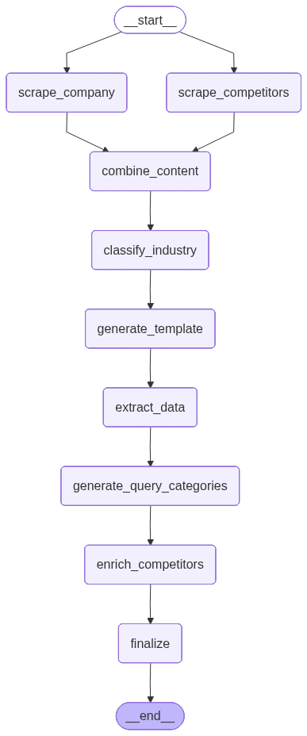
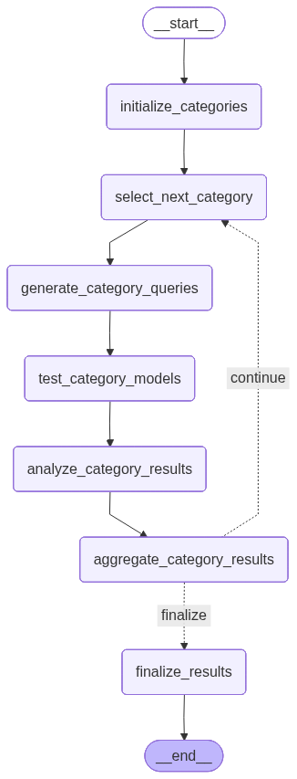

# 🎯 AI Visibility Scoring System

> Measure how frequently AI models mention your company when users search for industry-related queries.

---

## 📌 A. Problem Statement

Companies don't know if AI models like ChatGPT, Gemini, or Claude recommend them to potential customers. With 70%+ of users now asking AI for recommendations, **AI visibility = brand awareness**.

**Key Problems:**

- No way to measure "AI visibility" across different models
- Lack of competitive intelligence on competitor mentions
- No insights into which queries trigger company mentions

---

## 📌 B. Solution Overview

An **automated multi-agent system** using LangGraph workflows that:

1. **Analyzes Companies** - Scrapes websites, detects industry dynamically, identifies competitors
2. **Generates Smart Queries** - Creates 20-100 realistic queries using dynamic categories
3. **Tests AI Models** - Executes queries across 6 AI models (ChatGPT, Gemini, Claude, Llama, Grok, DeepSeek)
4. **Calculates Visibility** - Uses hybrid exact + semantic matching via ChromaDB
5. **Streams Results** - Real-time category-based progress updates

**Key Innovation: Hybrid Mention Detection**

- **Exact Matching**: Fast company name detection
- **Semantic Matching**: RAG-based via ChromaDB (catches "meal kit service" → HelloFresh)

**Impact & Value:**

- 📊 Quantifiable visibility metrics (0-100% score)
- 🎯 Per-model and per-category breakdowns
- ⚡ 70% cost reduction with slug-based caching
- 🚀 10-50ms response time on cached requests
- 💰 Free tier available (Llama via Groq)

---

## 📌 C. Architecture Diagram

### System Architecture

```
┌─────────────┐
│   FastAPI   │
│   Server    │
└──────┬──────┘
       │
       ▼
┌─────────────────────────────────────┐
│  Two-Phase Workflow                 │
│                                     │
│  Phase 1: Company Analysis          │
│    └─> Industry Detector Agent     │
│                                     │
│  Phase 2: Visibility Analysis       │
│    └─> Visibility Orchestrator     │
│        ├─> Query Generator          │
│        ├─> AI Model Tester          │
│        └─> Scorer Analyzer          │
└──────────────┬──────────────────────┘
               │
               ▼
┌──────────────────────────────────────┐
│  Storage Layer                       │
│  ├─> ChromaDB (vectors, semantic)   │
│  ├─> Redis (slug-based caching)     │
│  └─> RAG Store (query templates)    │
└──────────────────────────────────────┘
```

### Agent Workflow

```
Company URL
    ↓
[Agent 1] Industry Detector (9 nodes)
    → Parallel scraping, dynamic classification, generate query categories
    ↓
[Orchestrator] Visibility Orchestrator (7 nodes with looping)
    ↓
[Agent 2] Query Generator (per category)
    → Generate queries using dynamic templates
    ↓
[Agent 3] AI Model Tester (parallel batching)
    → Test across 6 AI models
    ↓
[Agent 4] Scorer Analyzer (hybrid matching)
    → Calculate visibility score
    ↓
Visibility Score + Detailed Report
```

### LangGraph Workflow Visualizations

#### Industry Detection Agent (9 Nodes)



The Industry Detector uses a 9-node LangGraph workflow that:

- Scrapes company and competitor pages in parallel
- Dynamically classifies industry (no hardcoded categories)
- Generates custom query categories per company
- Stores competitors in ChromaDB with rich embeddings

#### Visibility Orchestrator (7 Nodes with Conditional Looping)



The Visibility Orchestrator uses a 7-node LangGraph workflow with category-based batching:

- Processes one category at a time (comparison, product selection, etc.)
- Generates queries → Tests models → Analyzes results → Aggregates
- Conditional edge loops back for next category
- Streams progressive results after each category completes
- Provides partial scores and per-model breakdowns in real-time

---

## 📌 D. Tech Stack

**Backend**: FastAPI, Python 3.11+, Pydantic  
**AI Framework**: LangGraph (modular workflows), LangChain  
**LLM Providers**: Claude, Gemini, Llama (Groq), OpenAI, Grok, DeepSeek  
**Vector DB**: ChromaDB (semantic search, embeddings)  
**Caching**: Redis (slug-based, 24hr TTL per route)  
**Scraping**: Firecrawl API  
**Infrastructure**: Docker Compose, Uvicorn

---

## 📌 E. How to Run

### Quick Start

```bash
# 1. Clone and install
git clone <repo-url>
cd ai-visibility-scoring
uv sync  # or: pip install -r requirements.txt

# 2. Configure environment
cp .env.example .env
# Edit .env and add API keys (see section F below)

# 3. Start databases
docker-compose up -d

# 4. Run server
python run_server.py
# Or: uvicorn src.app:app --reload --port 8000

# 5. Access
# API Docs: http://localhost:8000/docs
# Health: http://localhost:8000/health
```

### API Usage

```bash
# Phase 1: Analyze company
curl -X POST http://localhost:8000/analyze/company \
  -H "Content-Type: application/json" \
  -d '{"company_url": "https://hellofresh.com"}'
# Returns: slug_id (e.g., "company_abc123")

# Phase 2: Visibility analysis
curl -X POST http://localhost:8000/analyze/visibility \
  -H "Content-Type: application/json" \
  -d '{
    "company_slug_id": "company_abc123",
    "num_queries": 20,
    "models": ["llama", "gemini"]
  }'
# Returns: visibility_score, model_scores, category_breakdown
```

---

## 📌 F. API Keys / Configuration

### Required API Keys

**Minimum (choose one):**

| Service       | Purpose              | Get Key                                                           | Cost      |
| ------------- | -------------------- | ----------------------------------------------------------------- | --------- |
| **Anthropic** | Claude (Recommended) | [console.anthropic.com](https://console.anthropic.com)            | Low cost  |
| **Groq**      | Llama (FREE)         | [console.groq.com](https://console.groq.com/keys)                 | FREE      |
| **Gemini**    | Gemini               | [makersuite.google.com](https://makersuite.google.com/app/apikey) | FREE tier |
| **Firecrawl** | Web scraping         | [firecrawl.dev](https://firecrawl.dev)                            | FREE tier |

**Optional (for testing AI models):**

- OpenAI (ChatGPT testing)
- OpenRouter (Grok, DeepSeek)

### Environment Variables

```bash
# LLM Provider (choose one)
INDUSTRY_ANALYSIS_PROVIDER=claude  # claude, gemini, llama, openai
QUERY_GENERATION_PROVIDER=claude

# API Keys (at least one required)
ANTHROPIC_API_KEY=sk-ant-...       # For Claude
GROK_API_KEY=gsk_...               # For Llama (FREE)
GEMINI_API_KEY=...                 # For Gemini
FIRECRAWL_API_KEY=...              # Required

# Optional
OPENAI_API_KEY=sk-...              # For ChatGPT testing
OPEN_ROUTER_API_KEY=sk-or-v1-...  # For Grok/DeepSeek
```

---

## 📌 G. Sample Inputs & Outputs

### Phase 1: Company Analysis

**Input:**

```json
POST /analyze/company
{
  "company_url": "https://hellofresh.com",
  "target_region": "United States"
}
```

**Output (SSE Stream):**

```json
{
  "step": "complete",
  "status": "success",
  "slug_id": "company_abc123",
  "cached": false,
  "data": {
    "company_name": "HelloFresh",
    "industry": "AI-Powered Meal Kit Delivery",
    "competitors": ["Blue Apron", "Home Chef", "EveryPlate"],
    "query_categories_template": {...}
  }
}
```

### Phase 2: Visibility Analysis

**Input:**

```json
POST /analyze/visibility
{
  "company_slug_id": "company_abc123",
  "num_queries": 20,
  "models": ["llama", "gemini"]
}
```

**Output (SSE Stream - Final Event):**

```json
{
  "step": "complete",
  "status": "success",
  "slug_id": "visibility_xyz789",
  "cached": false,
  "data": {
    "visibility_score": 45.5,
    "model_scores": {
      "llama-3.1-8b-instant": 50.0,
      "gemini-2.5-flash-lite": 41.0
    },
    "total_queries": 20,
    "total_mentions": 10,
    "category_breakdown": [
      {
        "category": "product_selection",
        "score": 50.0,
        "queries": 5,
        "mentions": 3
      }
    ],
    "model_category_matrix": {
      "llama-3.1-8b-instant": {
        "product_selection": 60.0,
        "comparison": 40.0
      }
    }
  }
}
```

### Detailed Reports (Optional)

```bash
# Get full report with competitor rankings
GET /report/visibility_xyz789

# Get paginated query log
POST /report/visibility_xyz789/query-log
{
  "page": 1,
  "limit": 50,
  "model": "llama"
}

# Export CSV
GET /report/visibility_xyz789/export/csv
```

---

---

## 📚 Documentation

- [AGENTS.md](AGENTS.md) - Agent overview and workflows
- [docs/ARCHITECTURE.md](docs/ARCHITECTURE.md) - System design and data flow
- [docs/API_ENDPOINTS.md](docs/API_ENDPOINTS.md) - Complete API reference
- [docs/LLM_PROVIDER_CONFIGURATION.md](docs/LLM_PROVIDER_CONFIGURATION.md) - LLM setup guide

---

---

Built with FastAPI, LangGraph, and ChromaDB
